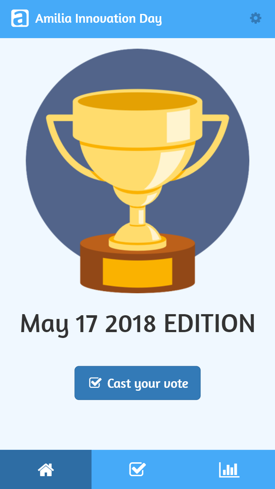

# Innovation Day Voting App

https://amilia.app




# Introduction
The voting app is a PHP app hosted on amilia.app. It runs on a AWS Lightsail VPS. Send an email to helpdesk@amilia.com to gain access.

# Dev local set up
On your Windows machine, install a WAMP (EasyPHP or whatever you like). Fork the repo and clone it in the right place. If you have EasyPHP, you should clone it directly as the `eds-www` folder in order to have `index.php` directly there.

## Setting up the database
In PhpMyAdmin, run this SQL to create the database and its tables:
```
CREATE DATABASE IF NOT EXISTS `innovation` DEFAULT CHARACTER SET utf8 COLLATE utf8_general_ci;
USE `innovation`;

CREATE TABLE `event` (
  `id` int(10) UNSIGNED NOT NULL,
  `name` varchar(255) NOT NULL,
  `date` date NOT NULL,
  `active` tinyint(1) NOT NULL DEFAULT '0'
) ENGINE=MyISAM DEFAULT CHARSET=utf8;

CREATE TABLE `person_votes` (
  `id` int(10) UNSIGNED NOT NULL,
  `event_id` int(10) UNSIGNED NOT NULL,
  `session` varchar(32) NOT NULL,
  `date` date NOT NULL,
  `name` varchar(255) NOT NULL,
  `vote1_project_id` int(10) UNSIGNED DEFAULT NULL,
  `vote2_project_id` int(10) UNSIGNED DEFAULT NULL,
  `vote3_project_id` int(10) UNSIGNED DEFAULT NULL
) ENGINE=MyISAM DEFAULT CHARSET=utf8;

CREATE TABLE `project` (
  `id` int(10) UNSIGNED NOT NULL,
  `event_id` int(10) UNSIGNED NOT NULL,
  `name` varchar(255) NOT NULL,
  `date` date NOT NULL
) ENGINE=MyISAM DEFAULT CHARSET=utf8;

ALTER TABLE `event`
  ADD PRIMARY KEY (`id`);

ALTER TABLE `person_votes`
  ADD PRIMARY KEY (`id`),
  ADD KEY `session` (`session`);

ALTER TABLE `project`
  ADD PRIMARY KEY (`id`);
```

## Setting up the configuration
File `lib/config.php` is necessary to set up database credentials. That file is not commited and ignored in git. You must create it. On your local environment, create `config.php` with this:
```
<?php
  define('DB_HOST', '127.0.0.1');
  define('DB_NAME', 'innovation');
  define('DB_USER', 'root');
  define('DB_PASSWORD', '');
  define('COOKIE_NAME', 'InnovationDay');
  define('ADMIN_PASSWORD', '');
  define('ADMIN_COOKIE_NAME', 'InnovationDayAdmin');
  define('ADMIN_COOKIE_SECRET_VALUE', md5(ADMIN_PASSWORD.'some secret string'));
?>
```
The `DB_*` constants are used to connect to the MySQL database.
The `COOKIE_NAME` constant is used to store the user session.
The `ADMIN_PASSWORD` constant is used to authentify an admin. On the server should be a real password. In development, leave blank for no password authentication. Once the user is authenticated, a cookie is saved with the name provided by constant `ADMIN_COOKIE_NAME` set to the value provided by constant `ADMIN_COOKIE_SECRET_VALUE`. To 'log out' everyone, just change the password.

## Running
In a browser, simply type `localhost:8080` and you should see that app.


# Understanding the codebase

The app is written with vanila PHP and Javascript; without any library for the back-end and the front-end. No AJAX is used either. No compilationand no transpilation required. Forms are used to send information to the browser using a simple `GET` passing parameters as query strings. This is a true Web 1.0 app. Fortunately, we use Bootstrap to make it look modern. On your mobile phone, you can't tell the difference :)

Routes load the PHP file in question. The main default route is `index.php`. Let's look at the content of that file to understand what's going on.
```
<?php
  ob_start();
  require 'lib/models.php';

  $_APP['page'] = 'home';
  $_APP['event'] = getCurrentEvent();
  $event_id = is_array($_APP['event']) ? $_APP['event']['id'] : NULL;
  $_APP['projects'] = getProjects($event_id);
  $_APP['person'] = getPerson($event_id);

  require 'lib/page.php';
  ob_flush();
?>
```

First, we initialize the output buffer with `ob_start`. As you `echo` HTML strings, it gets accunulated. At the end of the PHP script, we flush the buffer with `ob_flush` and that gets sent to the browser.

The project uses the MVC pattern. Routes like `index.php` and `vote.php` are effectively controllers. File `models.php` is the model layer which contains data access functions. It is the only file which talks to the database. It also creates a global `$_APP` array which contains the state of the application. The job of the controller is to fill the state and then call the view layout `page.php`.

The view layout `page.php` is the HTML document we will send. It loads necessary scripts, CSS and sets up the skeleton HTML. It will then load the view specified by `$_APP['page']`. For instance page `home` will load the view `lib/home_view.php`.

That's all there is to it.

## Entities
The voting app consists of 3 types of entities directly mapped to 3 SQL tables:
1. Event: The root entity representing the event in question. An event has a name and a date. There can only be one `active` event at a time. It is the one being displayed.
2. Project: An event has a list of projects. A project has a name and a foreign key to the event it belongs to.
3. Vote: A person can vote only once per event. Table `person_vote` links a person (uniquely identified by a session id saved in a browser cookie) and their casted votes in 3 hard-coded categories: `vote1_project_id`, `vote2_project_id` and `vote3_project_id`. A person can change their votes for the active event anytime. This simply updates the specific row.


# Deploying to prod
Log into the Lightsail VPS using Putty. Step into the `~/apps/innovation/www` folder and simply do a `git pull`. This will fetch the latest and greates from GitHub. No compilcation required (don't you love interpreted languages:). Database migrations, if any, should be run prior to updating the code. Use PhpMyAdmin to do that.

# Why the hell did you code this in PHP?
There's nothing like going back to basics sometimes. Every developer should know how to use PHP or even Perl to server Web pages. Its pretty bare bones and you can really hack your way to something cool. Heck, you can even directly code in prod if you like. Launch Putty and open up an editor like nano. You can modify PHP files directly on the server and see changes live. That's the beauty of interpreted languages. Kind of magic. Since the repo was cloned on the Linux box, you can use git to push changes or revert. Super fun to do. Of course, I do recommend you develop locally instead.


# TO DO
1. Authenticate admins. Currently, the admin pages are openly accessible to anyone. This should change for security reasons.
2. Create a new event. Currently, only the active existing event can be modified. In the admin page, we need to allow creating a new event and making it active.
3. Allow viewing non active events and switching the active event.
4. In `models.php`, throw errors when validation or SQL statements fail. In controllers, try/catch the errors and report them. Currently, we use `die` for some things, and ignore errors on SQL statements. Pretty bad.

